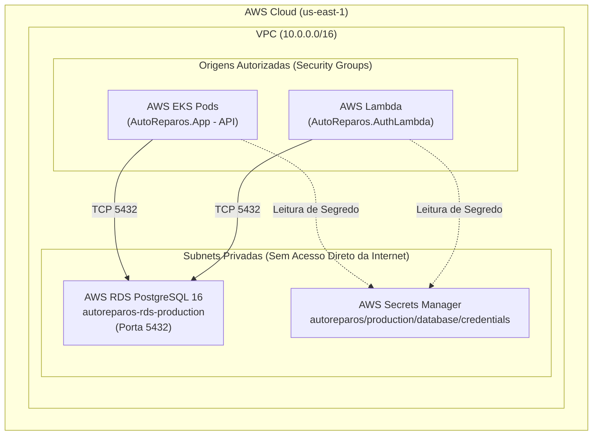

# AutoReparos.Infra.Database - Infraestrutura de Banco de Dados Gerenciado (Terraform)

> **Projeto:** AutoReparos - Sistema Integrado de Oficina Mecânica  
> **Fase:** Fase 3 Tech Challenge (13SOAT / 15SOAT FIAP)  
> **Componente Obrigatório:** Repositório 3/4 da Arquitetura Multi-Repo  
> **Tecnologias:** Terraform >= 1.7, AWS RDS PostgreSQL 16, AWS Secrets Manager, GitHub Actions.  
> **Repositório Oficial:** [Grupo78-PosTech-15SOAT/AutoReparos.Infra.Database](https://github.com/Grupo78-PosTech-15SOAT/AutoReparos.Infra.Database)

---

## 1. Visão Geral e Responsabilidades

Este repositório contém a definição de **Infraestrutura como Código (IaC)** responsável por provisionar, configurar e gerenciar o ciclo de vida do **Banco de Dados Relacional Gerenciado** da plataforma AutoReparos na nuvem AWS.

Em estrita conformidade com as exigências da Fase 3 do Tech Challenge FIAP SOAT:
1. **Banco Gerenciado:** Utiliza o serviço **AWS RDS PostgreSQL versão 16.3**.
2. **Isolamento em Subnets Privadas:** O cluster de banco de dados reside exclusivamente dentro de um `aws_db_subnet_group` vinculado a subnets privadas sem IP público (`publicly_accessible = false`).
3. **Segurança de Rede Restrita:** O Security Group do RDS libera conexões TCP na porta `5432` estritamente a partir dos Security Groups autorizados da aplicação:
   - Security Group do Cluster Kubernetes AWS EKS (Pods da API).
   - Security Group da AWS Lambda Serverless de autenticação (`AutoReparos.AuthLambda`).
4. **Parameter Group Otimizado:** Configuração de auditoria e logging (`log_connections`, `log_disconnections`, `log_min_duration_statement`).
5. **Segurança e Criptografia:** Armazenamento em disco criptografado em repouso (`storage_encrypted = true`) com KMS e geração e persistência de credenciais automáticas no **AWS Secrets Manager**.

---

## 2. Diagrama de Arquitetura de Rede



---

## 3. Estrutura de Arquivos

```
AutoReparos.Infra.Database/
├── .github/
│   └── workflows/
│       └── ci.yml               # Pipeline de CI (terraform fmt, init, validate)
├── terraform/
│   ├── main.tf                  # Recursos RDS, Subnet Group, Security Group, Secrets Manager e SSM Parameter Store
│   ├── variables.tf             # Definição e tipagem de variáveis de entrada
│   ├── outputs.tf               # Outputs exportados (Endpoints, ARNs, Connection Strings)
│   ├── providers.tf             # Provedor AWS e Random, configuração de backend S3
│   └── terraform.tfvars.example # Arquivo de exemplo para parametrização
├── .gitignore                   # Ignora estados (.tfstate), variáveis e locks locais
└── README.md                    # Este documento
```

---

## 4. Tabela de Variáveis Principais

| Variável | Tipo | Padrão | Descrição |
|---|---|---|---|
| `aws_region` | `string` | `"us-east-1"` | Região AWS onde os recursos serão criados |
| `environment` | `string` | `"production"` | Ambiente de execução |
| `vpc_id` | `string` | *Obrigatório* | ID da VPC para associação do Security Group |
| `private_subnet_ids` | `list(string)` | *Obrigatório* | Subnets privadas em AZs diferentes para o Subnet Group |
| `allowed_security_group_ids` | `list(string)` | `[]` | SGs do EKS e da Lambda autorizados no PostgreSQL |
| `db_name` | `string` | `"autoreparos_db"` | Nome inicial do banco de dados relacional |
| `db_username` | `string` | `"autoreparos_admin"` | Usuário master do PostgreSQL |
| `db_password` | `string` | `""` | Senha master (vazio gera senha forte via Secrets Manager) |
| `instance_class` | `string` | `"db.t4g.micro"` | Tipo da instância RDS (Graviton / Burstable) |
| `allocated_storage` | `number` | `20` | Tamanho inicial do disco em GiB (GP3) |
| `max_allocated_storage` | `number` | `20` | Limite de autoscaling em GiB (mantém perfil Free Tier) |
| `multi_az` | `bool` | `false` | Alta disponibilidade Multi-AZ |
| `backup_retention_period` | `number` | `7` | Dias de retenção de snapshots automatizados |

---

## 5. Outputs Exportados e Parâmetros SSM

Após o `terraform apply`, os seguintes valores são disponibilizados para consumo das outras camadas de infraestrutura e aplicações:

### Outputs do Terraform:
- `db_endpoint`: Endpoint de rede no formato `host:porta`.
- `db_address`: Host DNS do PostgreSQL.
- `db_port`: Porta TCP (padrão `5432`).
- `db_name`: Nome da base de dados criada (`autoreparos_db`).
- `db_security_group_id`: ID do Security Group gerenciado do RDS.
- `db_secret_arn`: ARN do segredo gerado no AWS Secrets Manager.
- `db_connection_string`: String de conexão compatível com Npgsql e EF Core (.NET).

### Parâmetros no AWS SSM Parameter Store:
- `/autoreparos/{environment}/database/endpoint`: Host e porta para conexão.
- `/autoreparos/{environment}/database/address`: Host DNS puro.
- `/autoreparos/{environment}/database/name`: Nome da base de dados.
- `/autoreparos/{environment}/database/secret_arn`: ARN do segredo no Secrets Manager.

---

## 6. Como Executar Localmente

### Pré-requisitos
- [Terraform CLI >= 1.7.0](https://developer.hashicorp.com/terraform/downloads)
- [AWS CLI v2](https://docs.aws.amazon.com/cli/latest/userguide/getting-started-install.html) autenticado com credenciais válidas.

### Passo a Passo de Execução

1. **Navegar até a pasta terraform:**
   ```bash
   cd terraform/
   ```

2. **Inicializar os módulos e provedores:**
   ```bash
   terraform init
   ```

3. **Configurar as variáveis de ambiente:**
   ```bash
   cp terraform.tfvars.example terraform.tfvars
   # Edite terraform.tfvars informando vpc_id, private_subnet_ids e allowed_security_group_ids
   ```

4. **Planejar a execução:**
   ```bash
   terraform plan -out=tfplan
   ```

5. **Aplicar a infraestrutura:**
   ```bash
   terraform apply tfplan
   ```

---

## 7. Desenvolvimento e Testes Locais com Docker Compose

Para testes locais de migrações e validação de consultas sem necessidade de provisionamento na nuvem AWS, este repositório disponibiliza um `docker-compose.yml` com **PostgreSQL 16** e **pgAdmin 4**:

```bash
# Iniciar o PostgreSQL 16 e pgAdmin 4 localmente
docker-compose up -d

# Acessar o pgAdmin: http://localhost:5050 (admin@autoreparos.com / Admin@123)
# Conexão direta PostgreSQL: localhost:5432 (admin / Admin@123)

# Parar o ambiente
docker-compose down
```

---

## 8. Integração e CI/CD

O repositório possui uma esteira automatizada no GitHub Actions (`.github/workflows/ci.yml`) com controle de concorrência e actions com commit SHA fixados:
- `terraform fmt -check`: Garante a formatação padrão da HashiCorp.
- `terraform init -backend=false`: Inicializa provedores de forma isolada.
- `terraform validate`: Valida a sintaxe e a consistência estática dos recursos HCL.
- `terraform plan`: Executado em Pull Requests condicionalmente à presença de credenciais AWS nos Secrets.
- `terraform apply`: Executado automaticamente após merge na branch `main` condicionalmente à presença de credenciais AWS nos Secrets.

---

## 9. Governança e Arquitetura Multi-Repo

- **Isolamento Multi-Repo:** Este repositório opera de maneira totalmente desacoplada dos repositórios de aplicação (`AutoReparos.App`), serverless (`AutoReparos.AuthLambda`) e Kubernetes (`AutoReparos.Infra.K8s`), comunicando-se através do AWS SSM Parameter Store e AWS Secrets Manager.
- **Proteção de Branch:** A branch `main` é protegida exigindo Pull Request com aprovação e validação verde de CI/CD antes do merge.
